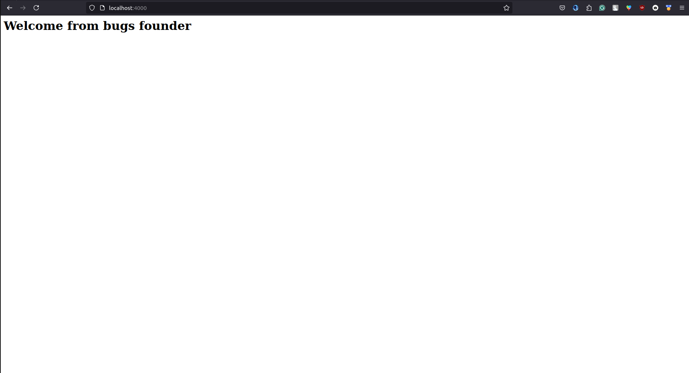
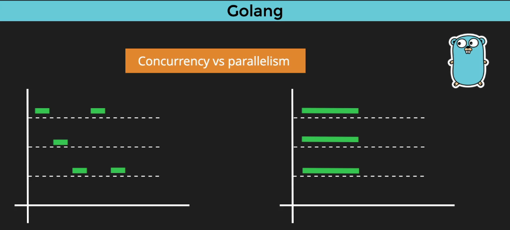
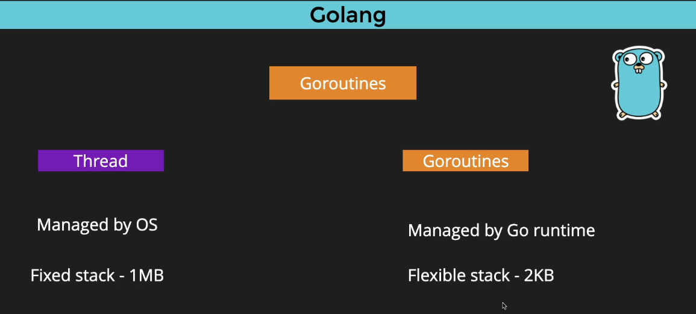
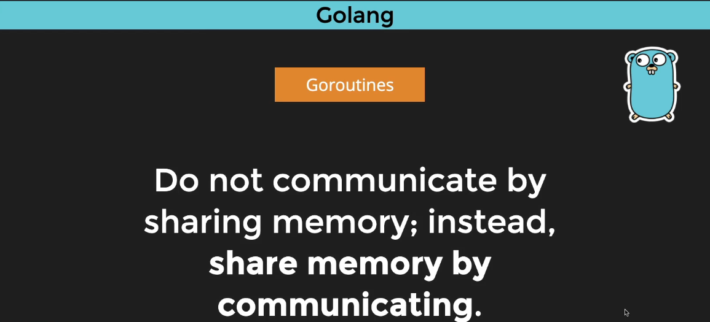

# Go

### Hello World Program
#### Program Creation steps
#### Create and Run the program
make a directory and a file called main.go inside the directory
```bash
mkdir hello
cd hello/
code .
```
create a file ```main.go```
### initialize go module
```bash
go mod init hello
```
Go has entry point which is ```main``` same like c and c++.
### write this code in ```main.go```
```go
package main

import "fmt"

func main() {
	fmt.Println("Hello from Bugs Founder")
}
```
### run the file
```bash
go run main.go
```


### Variables and Types 
declaring a variable

```go
// var <var_name> <DT_TYPE> = <value>
var username string = "BugsFounder"
fmt.Println(username)
fmt.Printf("Variable is of type: %T \n", username)

// boolean
var isLoggedIn bool = false
fmt.Println(isLoggedIn)
fmt.Printf("Variable is of type: %T \n", isLoggedIn)

// integers
// var smallVal uint8 = 256 // cannot use 256 (untyped int constant) as uint8 value in variable declaration (overflows)
var smallVal uint8 = 255
fmt.Println(smallVal)
fmt.Printf("variable is of type: %T \n", smallVal)

// float
// var smallFloat float32 = 255.32434343434343434545 // 255.32434
var smallFloat float64 = 255.32434343434343434545 // 255.32434343434343
fmt.Println(smallFloat)
fmt.Printf("Variable is of type: %T \n", smallFloat)
```
### Other important things
#### default values and some aliases
```go
var anotherVariable int // type int value 0
// var anotherVariable string // type string value ''
fmt.Println(anotherVariable)
fmt.Printf("Variable is of type: %T \n", anotherVariable) 
```
#### Implicit type
```go
	var website = "bugsfounder.com"
	fmt.Println(website)
``` 
#### Walrus operator 
```go
// no var style
numberOfUser := 300000
fmt.Println(numberOfUser)
```

#### Walrus operator is not allowed outside of the method
```go
package main

import "fmt"

// jwtToken := 300000 // error
// var jwtToken int = 300000 // ok

// public variable because first letter is capital "LoginToken"
const LoginToken string = "sadfassdlksdwerweuiwer" // Public

func main() {

	fmt.Println(LoginToken)
	fmt.Printf("Variable is of type: %T \n", LoginToken)

}

```
Note: if you've created a variable or imported something you must have to use it otherwise you're going to get an error
### Taking input from the user

```go
package main

import (
	"bufio"
	"fmt"
	"os"
)

func main() {
	welcome := "Welcome to user input"
	fmt.Println(welcome)

	reader := bufio.NewReader(os.Stdin)
	fmt.Println("Enter the rating for our pizza:")

	// comma ok || error ok
	input, _ := reader.ReadString('\n')
	fmt.Println("Thanks for rating,", input)
	fmt.Printf("Thanks for rating %T\n", input)
}
```

### Conversion
```go
package main

import (
	"bufio"
	"fmt"
	"os"
	"strconv"
	"strings"
)

func main() {
	welcome := "Welcome to our pizza app"
	fmt.Println(welcome)
	fmt.Println("Please rate our pizza between 1 and 5")

	reader := bufio.NewReader(os.Stdin)

	// this will also work but not preferable
	// inp, _ := bufio.NewReader(os.Stdin).ReadString('\n')
	// fmt.Println(inp)

	input, _ := reader.ReadString('\n')
	fmt.Println("Thanks for rating ", input)

	// conversion 
	
	// strconv.ParseFloat: parsing "4\n": invalid syntax
	numRating, err := strconv.ParseFloat(input, 64) // error

	// correct way
	numRating, err := strconv.ParseFloat(strings.TrimSpace(input), 64)

	if err != nil {
		fmt.Println(err)
	} else {
		fmt.Println("Added 1 to your rating: ", numRating+1)
	}
}
```

### Time and Date 
time module

```go
package main

import (
	"fmt"
	"time"
)

func main() {
	fmt.Println("Welcome to time study of golang")
	presentTime := time.Now()
	fmt.Println(presentTime)

	fmt.Println(presentTime.Format("02-01-2006 15:04:05 Monday")) // 02 -> day, 01 -> month, 2006 -> year, Monday --> day, casesensitive it has to be Monday not monday

	// learn more : https://go.dev/play/p/d_92jfpw8Xq

	createDate := time.Date(2020, time.August, 15, 23, 23, 0, 0, time.UTC)
	fmt.Println(createDate)
	fmt.Println(createDate.Format("01-02-2006 Monday"))
	

}
```

while working with dates and times formatters in go you always have to maintain the strings as constant which is given in the go doc. for Ex:- ```02 -> day, 01 -> month, 2006 -> year, Monday --> weekday name```, casesensitive it has to be ```Monday``` not ```monday```
* [Learn More in go Playground](https://go.dev/play/p/d_92jfpw8Xq)
* [Time Doc](https://pkg.go.dev/time#Time)

### Build executables for different operating systems
open the terminal and move to the go project directory and run below commands:
```bash
go env
```
output:
```bash
GO111MODULE=''
GOARCH='amd64'
GOBIN=''
GOCACHE='/home/bugsfounder/.cache/go-build'
GOENV='/home/bugsfounder/.config/go/env'
GOEXE=''
GOEXPERIMENT=''
GOFLAGS=''
GOHOSTARCH='amd64'
GOHOSTOS='linux'
GOINSECURE='' 
GOMODCACHE='/home/bugsfounder/go/pkg/mod'
GONOPROXY=''
GONOSUMDB='' 
GOOS='linux' # this line will help
GOPATH='/home/bugsfounder/go'
GOPRIVATE=''
GOPROXY='https://proxy.golang.org,direct'
GOROOT='/usr/local/go'
GOSUMDB='sum.golang.org'
GOTMPDIR=''
GOTOOLCHAIN='auto'
GOTOOLDIR='/usr/local/go/pkg/tool/linux_amd64'
GOVCS=''
GOVERSION='go1.22.4'
GCCGO='gccgo'
GOAMD64='v1'
AR='ar'
CC='gcc'
CXX='g++'
CGO_ENABLED='1'
GOMOD='/dev/null'
GOWORK=''
CGO_CFLAGS='-O2 -g'
CGO_CPPFLAGS=''
CGO_CXXFLAGS='-O2 -g'
CGO_FFLAGS='-O2 -g'
CGO_LDFLAGS='-O2 -g'
PKG_CONFIG='pkg-config'
GOGCCFLAGS='-fPIC -m64 -pthread -Wl,--no-gc-sections -fmessage-length=0 -ffile-prefix-map=/tmp/go-build3988505862=/tmp/go-build -gno-record-gcc-switches'
```

as you see ```GOOS='linux'`` line in the output we are going to use this to build executables, my os is linux i'm going to create executable for windows, linux or mac also.

run this command to build executable for windows from linux
``` bash
$ GOOS="windows" go build
```
you can update ```GOOS="windows" go build``` command as you're requirement
``` bash
$ GOOS="linux" go build
```
``` bash
$ GOOS="darwin" go build
```
or you can simply use ```go build``` to create executable for your os
```bash
go build
```

### Pointers
```go
package main

import "fmt"

func main() {
	fmt.Println("Welcome to a class on pointers")

	var ptr *int
	fmt.Println("value of pointer is:", ptr)

	// pointer -> *, reference -> &
	myNumber := 23
	// var ptr *int = &myNumber
	var ptr1 = &myNumber
	// var ptr *int = myNumber // error
	fmt.Println("Value of actual pointer is:", ptr1) // 0xc0000a4010
	fmt.Println("Value of actual pointer is:", *ptr1) // 23

	// updating variable value through pointer
	*ptr1 = *ptr1 + 3
	fmt.Println("New Value is:", *ptr1)

}
```

### Arrays in Go 
```go
package main

import "fmt"

func main() {
	fmt.Println("Welcome to array in golang")

	var fruitList [4]string
	fruitList[0] = "Apple"
	fruitList[1] = "Banana"
	fruitList[2] = "Grapes"

	fmt.Println("Fruit list is: ", fruitList)
	fmt.Println("Fruit list is: ", len(fruitList)) // 4

	var vegList = [3]string{"Potato", "Beans", "Mushroom"}
	fmt.Println("Vegy list is:", vegList)
	fmt.Println("Vegy list is:", len(vegList))

}
```

### Slices
```go
package main

import (
	"fmt"
	"sort"
)

func main() {
	fmt.Println("Welcome to slices")

	// CREATION
	var fruitList = []string{"Apple", "Tomato", "Peach"}
	fmt.Printf("Type of fruitList is %T\n", fruitList)

	// APPENDING
	fruitList = append(fruitList, "Mango", "Banana")
	fmt.Println(fruitList)

	// GETTING SLICES 
	// fruitList = append(fruitList[1:3])
	// fruitList = fruitList[1:3]
	fruitList = fruitList[0:3]
	fruitList = fruitList[0:]
	fruitList = fruitList[0:5]
	fmt.Println(fruitList)

	// CREATING SLICE
	highScores := make([]int, 4)
	highScores[0] = 234
	highScores[1] = 944
	highScores[2] = 454
	highScores[3] = 876

	// NOT WORK
	//	highScores[4] = 777 // error

	// WORK
	highScores = append(highScores, 555, 666, 321) // ok
	fmt.Println(highScores)
	fmt.Println(len(highScores))

	// SORTING
	fmt.Println(sort.IntsAreSorted(highScores))
	sort.Ints(highScores)
	fmt.Println(sort.IntsAreSorted(highScores))

	fmt.Println(highScores)

}
```

#### How to remove a value from slices based on index
```go
var courses = []string{"reactjs", "javascript", "swift", "python", "ruby"}
fmt.Println(courses)
var index int = 2
courses = append(courses[:index], courses[index+1:]...)
fmt.Println(courses)
```
```output
[reactjs javascript swift python ruby]
[reactjs javascript python ruby]
```

### Maps
maps are used to store key value pairs in go lang.
code example:
```go
language := make(map[string]string)
// adding values
language["JS"] = "Javascript"
language["RB"] = "Ruby"
language["PY"] = "Python"

// printing entire map and a specific key / value
fmt.Println("List of all language: ", language)
fmt.Println("Js Shorts for: ", language["JS"])

// deleting/removing item from map
delete(language, "RB")
fmt.Println("List of all language: ", language)

// loops are interesting in golang
for key, value := range language {
	fmt.Printf("For key %v, value is %v\n", key, value)
}

// comma ok
for _, value := range language {
	fmt.Printf("For key v, value is %v\n", value)
}
```

### Intro to Struct
There is no inheritance in go lang; No super or parent ...
```go

func main() {
	fmt.Println("Structs in go lang")

	bugs := User{"Bugs Founder", "bugsfounder2021@gmail.com", true, 20}
	fmt.Println(bugs)
	fmt.Printf("Bugs details are: %+v\n", bugs)
	fmt.Printf("Name is %v and email is %v\n", bugs.Name, bugs.Email)
	
}

type User struct {
	Name   string 
	Email  string
	Status bool
	Age    int
}

```

```output
{Bugs Founder bugsfounder2021@gmail.com true 20}
Bugs details are: {Name:Bugs Founder Email:bugsfounder2021@gmail.com Status:true Age:20}
Name is Bugs Founder and email is bugsfounder2021@gmail.com
```

```%+v``` is very useful to print struct with full detail.

# if else 
To check conditions.
```go
loginCount := 23
var result string

// if-else if-else ladder 
if loginCount < 10 {
	result = "Regular user"
} else if loginCount > 10 {
	result = "Watch out"
} else {
	result = "Exactly 10 login count"
}

fmt.Println(result)

// if else
if 9%2 == 0 {
	fmt.Println("Number is even")
} else {
	fmt.Println("Number is odd")
}

// creating variable and checking it in if
if num := 3; num < 10 {
	fmt.Println("Num is less than 10")
} else {
	fmt.Println("Num is NOT Less than 10")
}

// reverse condition statement '!'
// if err!= nil{

// }
```
### Switch Case
```go
func main() {
	fmt.Println("Switch and case in golang")

	// rand.Seed(time.Now().UnixNano()) // rand.Seed is deprecated
	// we can use crypto 

	diceNumber := rand.Intn(6) + 1

	fmt.Println("Value of dice is ", diceNumber)

	switch diceNumber {
	case 1:
		fmt.Println("Dice value is 1 and you can open")
	case 2:
		fmt.Println("You can move 2 spot")
	case 3:
		fmt.Println("You can move 3 spot")
		fallthrough // runs all cases below this case except last
	case 4:
		fmt.Println("You can move 4 spot")
		fallthrough // runs all cases below this case
	case 5:
		fmt.Println("You can move 5 spot")
	case 6:
		fmt.Println("You can move 6 spot and roll dice again")
	default:
		fmt.Println("What was that!")
	}
}
```

### Loops
Basic Kind of loops or traditional for loop
```go
days := []string{"Sunday", "Tuesday", "Wednesday", "Friday", "Saturday"}

fmt.Println(days)

// Basic / old
for d := 0; d < len(days); d++ {
	fmt.Println(days[d])
}
```
#### Get index in i and iterate
```go
for i := range days {
	// i is index
	fmt.Println(days[i])
}
```
#### Kind of for-each (for each loop)
```go
for index, day := range days {
	fmt.Printf("index is %v and value is %v\n", index, day)
}
```
#### kind of while loop
```go
rougueValue := 1
for rougueValue < 10 {
	fmt.Println("Value is : ", rougueValue)
	// ++rougueValue // error
	rougueValue++
}
```
#### break statement
```go
rougueValue := 1
for rougueValue < 10 {
	if rougueValue == 5 {
		rougueValue++
		break
	}
	fmt.Println("Value is : ", rougueValue)
	rougueValue++
}
```
#### continue statemetn
```go
rougueValue := 1
for rougueValue < 10 {
	if rougueValue == 5 {
		rougueValue++
		continue
	}
	fmt.Println("Value is : ", rougueValue)
	rougueValue++
}
```
#### goto statement
defining a label
```go
bf:
	fmt.Println("Jumping at bugsfounder.com")
```
Using goto statement to jump to the label
```go
rougueValue := 1
for rougueValue < 10 {
	if rougueValue == 2 {
		goto bf // jumping to the level
	}
	fmt.Println("Value is : ", rougueValue)
	rougueValue++
}
```

### Functions
Simple Functions
```go
func greeter() {
	fmt.Println("Namastey from golang")
}
```

#### Get any number of arguments or params (variadic functions)
```go
func proAdder(values ...int) int {
	total := 0
	for _, values := range values {
		total += values
	}

	return total
}
```

#### return multiple values
```go
func proAdderMul(values ...int) (int, string) {
	total := 0
	for _, values := range values {
		total += values
	}

	return total, "Hello Pro Adder"
}
```

#### Using functions
``` go
func main() {
	fmt.Println("Functions in Go")

	// greeter // reference
	greeter() // call

	// Note: cannot create function inside function

	result := adder(3, 5)
	fmt.Println("Result is: ", result)

	proResult := proAdder(1, 2, 3, 5, 4, 5, 4, 3)
	fmt.Println("Pro result is: ", proResult)

	mulR, myMessage := proAdderMul(1, 4, 3, 23, 5)

	fmt.Println(mulR, myMessage)

}
```
Note: Type of parameters and return types are compulsory

### Methods 
Methods are similar to functions, the difference is methods are those functions which are written into a class but we don't have classes in go so the methods are those functions which are written into the structs.
```go
type User struct {
	Name   string
	Email  string
	Status bool
	Age    int
	// oneAge int // private 'first letter small'
}
```
```go
func (u User) GetStatus() {
	fmt.Println("Is user active: ", u.Status)

}
```
```go
func (u User) NewMail() {
	u.Email = "test@go.dev"
	fmt.Println("Email of this user is: ", u.Email)
}
```

```go
func main() {

	bugs := User{"Bugs Founder", "bugsfounder2021@gmail.com", true, 20}
	fmt.Println(bugs)

	bugs.GetStatus()
	bugs.NewMail() // test@go.dev
	fmt.Println(bugs.Email) // "bugsfounder2021@gmail.com"
}
```
Note: for update the original value we use pointers or references.

### Defer in go lang
All defer statements in a codebase are aligned at the end of the code 'main' function, then it prints the aligned values in LIFO Manner. ex: 0,1,2,3,4 (aligned using defer), prints: 4,3,2,1,0
```go
func myDefer() {
	for i := 0; i < 5; i++ {
		defer fmt.Println(i)
	}
}
```
```go
func main() {
	defer fmt.Println("World")
	defer fmt.Println("One")
	defer fmt.Println("Two")

	myDefer() 
}
```
deferred prints values in LIFO manner
alignment: world, One, Two, 0, 1, 2, 3, 4
```output
4
3
2
1
0
Two
One
World
```

### Files in GO 

#### ReadFile function to read contents of a file and print the contents of that file into the terminal
```go
func readFile(filename string) {
	databyte, err := ioutil.ReadFile(filename) // deprecated
	// default data type of ReadFile func is Byte

	checkNilError(err)

	fmt.Println("Text Data inside the file is \n", string(databyte))
}
```
#### This logic is repeating to many times so it is good to wrap it into a function.
```go
if err != nil {
	panic(err)
}
```
Created a function ```checkNilError()```
#### Function to check err so we don't need to repeat the same logic again and again.
```go
func checkNilError(err error) {
	if err != nil {
		panic(err)
	}
}
```
#### Function to Write into a file
```go
func writeFile(filename string, content string) {
	// Creating a file
	file, err := os.Create(filename)

	// checking error
	checkNilError(err)

	// writing to the file
	length, err := io.WriteString(file, content)

	// checking error
	checkNilError(err)

	fmt.Println(length)

	// close file at the end of the program 'end of the main function'
	defer file.Close()
}
```

```go
package main

import (
	"fmt"
	"io"
	"io/ioutil"
	"os"
)

func main() {
	fmt.Println("Welcome to files in golang")
fmt.Println("Welcome to files in golang")

	content := "This needs to go in a file - BugsFounder.com" // content
	filename := "./mybffile.txt"                              // filename

	// writing to file using writeFile function 
	writeFile(filename, content)


	// reading the file using readFile function 
	readFile(filename) // reading file './mybffile.txt'

}
```

### Web Requests in GO
Creating a function which send a get request to url and returns string content
```go
func request(url string) (data string, err error) {
	res, err := http.Get(url) // Get Request

	// checking status code if it is ok return str data 
	if res.StatusCode == 200 {

		databyte, err := io.ReadAll(res.Body)

		checkNilError(err)

		return string(databyte), nil
	}

	// return error
	return "", err
}
```

#### Using request function
sending request to url using request function which we have created.
```go
package main

import (
	"fmt"
	"io"
	"net/http"
)

// dummy apis: https://jsonplaceholder.typicode.com/
const url = "https://jsonplaceholder.typicode.com/posts/1"

func main() {
	fmt.Println("Welcome to web request")

	res_content, err := request(url)

	checkNilError(err)

	fmt.Println(res_content)

}
```

### URLs in Go (url)
```go
package main

import (
	"fmt"
	"net/url"
)

const myurl = "https://www.bugsfounder.com/learn?coursename=go&payment_id=asdfa4345-bugs"

func main() {
	fmt.Println("Welcome to handling urls")

	result, _ := url.Parse(myurl)

	fmt.Println("Scheme: ", result.Scheme)
	fmt.Println("Host: ", result.Host)
	fmt.Println("Path: ", result.Path)
	fmt.Println("Port: ", result.Port())
	fmt.Println("RawPath: ", result.RawPath)
	fmt.Println("RawQuery: ", result.RawQuery)
	fmt.Println("User: ", result.User)

	qparams := result.Query()

	fmt.Printf("The type of query params are: %T\n", qparams)

	fmt.Println(qparams["coursename"])
	fmt.Println(qparams["payment_id"])

	for key, value := range qparams {
		fmt.Println(key, value)
	}

	// url must be always a reference '&url' not 'url'
	partsOfUrl := &url.URL{
		Scheme:  "https",
		Host:    "bugsfounder.com",
		Path:    "/go",
		RawPath: "user=bugs",
	}

	anotherUrl := partsOfUrl.String()

	fmt.Println(anotherUrl)
}
```

### Handling Requests
#### Get Request 
```go
func PerformGetRequest() {
	const myurl = "http://localhost:8000/get"

	res, err := http.Get(myurl) // sending get request

	if err != nil {
		panic(err)
	}

	defer res.Body.Close() // closing server

	// printing some information of response
	fmt.Println("Status Code: ", res.StatusCode)
	fmt.Println("Content Length is: ", res.ContentLength)

	// reading message of response
	var responseString strings.Builder
	content, _ := io.ReadAll(res.Body)

	byteCount, _ := responseString.Write(content)
	fmt.Println("ByteCount is: ", byteCount)
	fmt.Println(responseString.String())

	// fmt.Println(content)
	// fmt.Println(string(content))

}
```

```go
package main

import (
	"fmt"
	"io"
	"net/http"
	"strings"
)

func main() {
	fmt.Println("Welcome to web verb video - BF")

	PerformGetRequest()
}
```
Better way to convert byte data into string or others, `string(content)` is not recommended for pro codes
```go
var responseString strings.Builder
content, _ := io.ReadAll(res.Body)

byteCount, _ := responseString.Write(content)
fmt.Println("ByteCount is: ", byteCount)
fmt.Println(responseString.String())
```

#### Perform Post Json Request

```go
func PerformPostJsonRequest() {
	const myurl = "http://localhost:8000/post"

	// fake json payload
	requestBody := strings.NewReader(`
		{
			"cousename":"Let's go with golang",
			"price":0,
			"platform":"youtube.com"
		}
	`)

	// sending post request
	res, err := http.Post(myurl, "application/json", requestBody)

	if err != nil {
		panic(err)
	}

	// closing request
	defer res.Body.Close()

	// reading the data
	content, _ := io.ReadAll(res.Body)
	fmt.Println(string(content)).😎

}
```e
Call the function ```PerformPostJsonRequest()``` in ```main()``` and enjoy 😎.

#### Perform PostForm Request
```go
func PerformPostFormRequest() {
	const myurl = "http://localhost:8000/postform"

	// formdata
	data := url.Values{}
	data.Add("firstname", "Bugs")
	data.Add("lastname", "Founder")
	data.Add("email", "bugsfounder2021@gmail.com")

	// sending request
	res, err := http.PostForm(myurl, data)

	if err != nil {
		panic(err)
	}

	defer res.Body.Close() // closing the connection

	// reading response
	content, _ := io.ReadAll(res.Body)

	// creating string builder to convert response into string (default is byte)
	var responseString strings.Builder

	// writing content into the builder
	responseString.Write(content)
	// byteCount, _ := responseString.Write(content)

	// getting data into string
	fmt.Println(responseString.String())
}
```
Call the function ```PerformPostFormRequest()``` in ```main()``` and enjoy 😎.


### Encode JSON
Create JSON data in golang
#### imports
```go
import (
	"encoding/json"
	"fmt"
)
```

Step 1: create a struct as scheme
```go
type course struct {
	Name     string `json:"coursename"` // in json Name shows as coursename 
	Price    int
	Platform string   `json:"website"`
	Password string   `json:"-"`             // ignored, i don't want to reveal password
	Tags     []string `json:"tags,omitempty"` // if nil then leave it empty
}
```
step 2: function to generate json 
```go
func EncodeJson() {

	bfcourses := []course{
		{"ReactJS Bootcamp", 266, "LearnCodeOnline.in", "asdeoi@3342", []string{"web", "js", "dev"}},
		{"MERN Bootcamp", 443, "LearnCodeOnline.in", "bets#433", []string{"web", "js", "dev", "mern"}},
		{"Angular Bootcamp", 456, "LearnCodeOnline.in", "w3erwsd23543", nil},
	} // `course` is the struct that we have created in step 1

	// package this data as JSON data

	// finalJson, err := json.Marshal(bfcourses)
	// finalJson, err := json.MarshalIndent(bfcourses, "BF", "\t")
	finalJson, err := json.MarshalIndent(bfcourses, "", "\t")

	if err != nil {
		panic(err)
	}

	fmt.Printf("data: %s\n", finalJson)

}
```
#### main 
```go
func main() {
	fmt.Println("Welcome to JSON")
	EncodeJson()
}
```
some functions and their difference, shown in function ```EncodeJson()```
1. Marshal()
```go
finalJson, err := json.Marshal(bfcourses)
```
```output
data: [{"Name":"ReactJS Bootcamp","Price":266,"Platform":"LearnCodeOnline.in","Password":"asdeoi@3342","Tags":["web","js","dev"]},{"Name":"MERN Bootcamp","Price":443,"Platform":"LearnCodeOnline.in","Password":"bets#433","Tags":["web","js","dev","mern"]},{"Name":"Angular Bootcamp","Price":456,"Platform":"LearnCodeOnline.in","Password":"w3erwsd23543","Tags":null}]

```
2. MarshalIndent() with prefix
```go
finalJson, err := json.MarshalIndent(bfcourses, "BF", "\t")
```
```output
data: [
BF      {
BF              "coursename": "ReactJS Bootcamp",
BF              "Price": 266,
BF              "website": "LearnCodeOnline.in",
BF              "_": "asdeoi@3342",
BF              "tags": [
BF                      "web",
BF                      "js",
BF                      "dev"
BF              ]
BF      },
BF      {
BF              "coursename": "MERN Bootcamp",
BF              "Price": 443,
BF              "website": "LearnCodeOnline.in",
BF              "_": "bets#433",
BF              "tags": [
BF                      "web",
BF                      "js",
BF                      "dev",
BF                      "mern"
BF              ]
BF      },
BF      {
BF              "coursename": "Angular Bootcamp",
BF              "Price": 456,
BF              "website": "LearnCodeOnline.in",
BF              "_": "w3erwsd23543"
BF      }
BF]
```
3. MarshalIndent() without prefix
```go
finalJson, err := json.MarshalIndent(bfcourses, "", "\t")
```
```output
data: [
        {
                "coursename": "ReactJS Bootcamp",
                "Price": 266,
                "website": "LearnCodeOnline.in",
                "_": "asdeoi@3342",
                "tags": [
                        "web",
                        "js",
                        "dev"
                ]
        },
        {
                "coursename": "MERN Bootcamp",
                "Price": 443,
                "website": "LearnCodeOnline.in",
                "_": "bets#433",
                "tags": [
                        "web",
                        "js",
                        "dev",
                        "mern"
                ]
        },
        {
                "coursename": "Angular Bootcamp",
                "Price": 456,
                "website": "LearnCodeOnline.in",
                "_": "w3erwsd23543"
        }
]
```

### Decode JSON into struct and map
struct 
```go
type course struct {
	Name     string `json:"coursename"`
	Price    int
	Platform string   `json:"website"`
	Password string   `json:"-"`              // ignored, i don't want to reveal password
	Tags     []string `json:"tags,omitempty"` // if nil then leave it empty
}
```
```go
func DecodeJson() {

	// this is just a dummy string json data we have converted it into byte so it looks like coming for web because web response are in byte.
	jsonDataFromWeb := []byte(`
	{
		"coursename": "MERN Bootcamp",
		"Price": 443,
		"website": "LearnCodeOnline.in",
		"_": "bets#433",
		"tags": ["web","js","dev","mern"]
	}
	`)

	var lcoCourse course

	// checking json is valid or not
	checkValid := json.Valid(jsonDataFromWeb)

	// if valid unmarshal the data
	if checkValid {
		fmt.Println("JSON was valid")
		json.Unmarshal(jsonDataFromWeb, &lcoCourse)
		fmt.Printf("%#v\n", lcoCourse)
	} else {
		fmt.Println("JSON WAS NOT VALID")
	}

	// MAP
	// some cases where you just want to add data to key value (map)
	var myOnlineData map[string]interface{} // we don't know what is the type of value is so we use interface

	// unmarshaling data into map
	json.Unmarshal(jsonDataFromWeb, &myOnlineData)
	fmt.Printf("%#v\n", myOnlineData)

	// key value pairs
	for key, value := range myOnlineData {
		fmt.Printf("key is %v and value is %v and Type is %T\n", key, value, value)
	}
}
```
Call the function ```DecodeJson()``` in ```main()``` and enjoy 😎.

### MOD in go (mod)
Let's try to use an external module from github into our workspace:
- [gorilla/mux](https://github.com/gorilla/mux?tab=readme-ov-file)
- [installation](https://github.com/gorilla/mux?tab=readme-ov-file#install)

create a folder, then create a file called ```main.go`` in it and open terminal into the folder/directory and follow below steps:

step 1: initialize the module in better way
```go
go mod init github.com/bugsfounder/mymodules
```
you can see go.mod file in your workspace
```go.mod```
```go
module github.com/bugsfounder/mymodules

go 1.22.4
```
step 2: install the gorilla/mux module
```go
go get -u github.com/gorilla/mux
```
output
```output
go: downloading github.com/gorilla/mux v1.8.1
go: added github.com/gorilla/mux v1.8.1
```
Note: you can get ```go get -u github.com/gorilla/mux``` this command on the documentation too.

Now you can see a go.sum file into your working directory.

#### Need to understand
Now if you see into your go.mod file it looks like this:
```go
module github.com/bugsfounder/mymodules

go 1.22.4

require github.com/gorilla/mux v1.8.1 // indirect
```
You can see a ```indirect``` thing at the end of the last line, this is the gorilla/mux module which we have installed, it is warning you that this module is indirect to make it direct we have to run a command ```go mod tidy```.

After runnig ```go mod tidy``` now you can see the ```//indirect``` this no more there in the file.
```go
module github.com/bugsfounder/mymodules

go 1.22.4

require github.com/gorilla/mux v1.8.1
``` 

#### Writing some code in gorilla/mux
imports
```go
import (
	"fmt"
	"log"
	"net/http"

	"github.com/gorilla/mux"
)
```
functions
```go
func greeter() {
	fmt.Println("hey there mod users")

}

func serveHome(w http.ResponseWriter, r *http.Request) {
	w.Write([]byte("<h1>Welcome from bugs founder</h1>"))
}
```
main
```go
func main() {
	fmt.Println("Hello mod in go lang")
	greeter()

	r := mux.NewRouter()
	r.HandleFunc("/", serveHome).Methods("GET")

	log.Fatal(http.ListenAndServe(":4000", r))
}
```
run the program this will start a server at port 4000
```go
go run main.go
```
firefox 


#### Some Useful Commands:
```go
go mot init <module_name>
```
```go
go mod tidy
```
```go
go mod verify // verifies all modules are good
```
```go
go build . // build an executable
```

##### GO LIST 
List your module
``` ternimal
go list
```
```output
github.com/bugsfounder/mymodules
```
Lists all the modules available on system
```go
go list all 
```
output
```ternimal
bufio
bytes
cmp
compress/flate
compress/gzip
container/list
context
crypto
crypto/aes
crypto/cipher
crypto/des
crypto/dsa
crypto/ecdh
crypto/ecdsa
crypto/ed25519
crypto/elliptic
crypto/hmac
crypto/internal/alias
crypto/internal/bigmod
crypto/internal/boring
crypto/internal/boring/bbig
crypto/internal/boring/sig
crypto/internal/edwards25519
crypto/internal/edwards25519/field
crypto/internal/nistec
crypto/internal/nistec/fiat
crypto/internal/randutil
crypto/md5
crypto/rand
crypto/rc4
.
.
.
```
Lists the modules which is used by current module
```go
go list -m all 
```
output
```
github.com/bugsfounder/mymodules
github.com/gorilla/mux v1.8.1
```

gives all versions available for the module
```go
go list -m -versions github.com/gorilla/mux
```
output
```
github.com/gorilla/mux v1.2.0 v1.3.0 v1.4.0 v1.5.0 v1.6.0 v1.6.1 v1.6.2 v1.7.0 v1.7.1 v1.7.2 v1.7.3 v1.7.4 v1.8.0 v1.8.1
```
##### Some other commands
```go
go mod why github.com/gorilla/mux
```
output
```
# github.com/gorilla/mux
github.com/bugsfounder/mymodules
github.com/gorilla/mux
```

graph command
```go
go mod graph
```
output
```
github.com/bugsfounder/mymodules github.com/gorilla/mux@v1.8.1
github.com/bugsfounder/mymodules go@1.22.4
go@1.22.4 toolchain@go1.22.4
```

##### mod edit
```
go mod edit -go 1.16
```
```
go mod edit -module newmodule
```

##### vendor
```go
go mod vendor
```
run code using vendor
```
go run -mod=vendor main.go 
```

- [Learn More abour Module](https://go.dev/ref/mod)
- [Semantic Versioning 2.0.0](https://semver.org/)

### Building API in GO Lang
Let's make Models first:
```go
// Model for course - file
type Course struct {
	CourseId    string  `json:"courseid"`
	CourseName  string  `json:"coursename"`
	CoursePrice int     `json:"price"`
	Author      *Author `json:"author"`
}

type Author struct {
	Fullname string `json:"fullname"`
	Website  string `json:"website"`
}
```
We have two models now Course and Author

#### Let's Create a DB (Fake DB for now 😎)
```go
// Fake DB
var courses []Course
```

#### Let's Create some middleware or helper 
```go
// middleware, helper - file
func (c *Course) IsEmpty() bool {
	return c.CourseId == "" && c.CourseName == ""
}
```
```- file``` simply means, this logic should be written into a saperate file but for now we are writting all these in one file for better understanding, but it is not recommended.

#### Controllers - file
##### CRUD Operations
Creating some route functions 

Serving home
```go
func serveHome(w http.ResponseWriter, r *http.Request) {
	w.Write([]byte("<h1>Welcome to API By BugsFounder</h1>"))
}
```

#### READ
Handeler to GET ALL COURSES ```getAllCourses()```
```go
func getAllCourses(w http.ResponseWriter, r *http.Request) {
	fmt.Println("Get all courses")
	w.Header().Set("Content-type", "application/json")
	json.NewEncoder(w).Encode(courses)
}
```

Handeler to GET ONE COURSE ```getOneCourse()```
```go
func getOneCourse(w http.ResponseWriter, r *http.Request) {
	fmt.Println("Get One Course")
	w.Header().Set("Content-Type", "application/json")

	// grab id from reqeust
	params := mux.Vars(r)

	// loop through courses, find matching id and return the response
	for _, course := range courses {
		if course.CourseId == params["id"] {
			json.NewEncoder(w).Encode(course)
			return
		}
	}
	json.NewEncoder(w).Encode("No Course found with given id")
	return
}
```

#### CREATE
Handeler to CREATE ONE COURSE ```createOneCourse()```
```go
func createOneCourse(w http.ResponseWriter, r *http.Request) {
	fmt.Println("Create one course")
	w.Header().Set("Content-Type", "application/json")

	// what if : body is empty
	if r.Body == nil {
		json.NewEncoder(w).Encode("Please send some data")
	}

	// what about - {}
	var course Course
	_ = json.NewDecoder(r.Body).Decode(&course)

	if course.IsEmpty() {
		json.NewEncoder(w).Encode("No data inside JSON")
		return
	}
	// TODO: Check only if title is duplicate
	// loop, title matches with course.coursename, JSON
	for _, cour := range courses {
		if cour.CourseName == course.CourseName {
			json.NewEncoder(w).Encode("Same Course is already present in the DB Duplicates are not allowed.")
			return
		}
	}

	// generate unique id, string
	// append course into courses

	// DEPRECATED `rand.Seed`
	// rand.Seed(time.Now().UnixNano()) // deprecated
	// course.CourseId = strconv.Itoa(rand.Intn(100))

	// Create a new random number generator with a custom seed (e.g.,)
	source := rand.NewSource(time.Now().UnixNano())
	rng := rand.New(source)

	// Generate a random number
	course.CourseId = strconv.Itoa(rng.Intn(100))
	courses = append(courses, course)
	json.NewEncoder(w).Encode(course)
	return
}
```

#### UPDATE
Handeler to UPDATE ONE COURSE ```UpdateOneCourse()```
```go
func updateOneCourse(w http.ResponseWriter, r *http.Request) {
	fmt.Println("update one course")
	w.Header().Set("Content-Type", "application/json")

	// first - grab id from request
	params := mux.Vars(r)

	// loop, id, remove, add with my ID
	for index, course := range courses {
		if course.CourseId == params["id"] {
			courses = append(courses[:index], courses[index+1:]...)
			var course Course
			_ = json.NewDecoder(r.Body).Decode(&course)
			course.CourseId = params["id"]
			courses = append(courses, course)
			json.NewEncoder(w).Encode(course)
			return
		}
	}

	// TODO: send a response when id is not found
}
```

#### DELETE
Handeler to DELETE ONE COURSE ```deleteOneCourse()```
```go
func deleteOneCourse(w http.ResponseWriter, r *http.Request) {
	fmt.Println("delete one course")
	w.Header().Set("Content-Type", "application/json")

	params := mux.Vars(r)

	// loop, id, remove (index, index + 1)

	for index, course := range courses {
		if course.CourseId == params["id"] {
			courses = append(courses[:index], courses[index+1:]...)
			json.NewEncoder(w).Encode("Successfully deleted the course")
			return
		}
	}
	json.NewEncoder(w).Encode("Unable to find and deleted the course")
}
```

#### Creating APIs and start and listen to the server 
main function is here
```go
func main() {
	fmt.Println("API - BugsFOunder.com")

	// new router
	r := mux.NewRouter()

	// seeding - inserting some data into db
	courses = append(courses, Course{CourseId: "2", CourseName: "ReactJS", CoursePrice: 433, Author: &Author{Fullname: "Bugs Founder", Website: "bugsfounder.com"}})
	courses = append(courses, Course{CourseId: "4", CourseName: "MERN Stack", CoursePrice: 534, Author: &Author{Fullname: "Bugs Founder", Website: "bugsfounder.com"}})

	// routing
	r.HandleFunc("/", serveHome).Methods("GET")
	r.HandleFunc("/courses", getAllCourses).Methods("GET")
	r.HandleFunc("/course/{id}", getOneCourse).Methods("GET")
	r.HandleFunc("/course", createOneCourse).Methods("POST")
	r.HandleFunc("/course/{id}", updateOneCourse).Methods("PUT")
	r.HandleFunc("/course/{id}", deleteOneCourse).Methods("DELETE")

	// listen to a port (4000)
	log.Fatal(http.ListenAndServe(":4000", r))
}
```

for learn more about routings visite here [Gorilla/mux](https://github.com/gorilla/mux?tab=readme-ov-file#install)

## Goroutins
Do not communicate by sharing memory; instead share memory by communicating.




code example:
```go
package main

import (
	"fmt"
	"net/http"
	"sync"
	"time"
)

var wg sync.WaitGroup // usually variable is pointer

func main() {
	// go greeter("Hello")
	// greeter("World")

	websiteList := []string{
		"https://google.com",
		"https://go.dev",
		"https://fb.com",
		"https://github.com",
		"https://bugsfounder.com",
	}

	for _, web := range websiteList {
		go getStatusCode(web)
		wg.Add(1)
	}

	wg.Wait()
}

func greeter(s string) {
	for i := 0; i < 6; i++ {
		time.Sleep(3 * time.Millisecond) // not good idea but we can see at someplaces
		fmt.Println(s)
	}
}

func getStatusCode(endpoint string) {
	defer wg.Done()

	res, err := http.Get(endpoint)
	if err != nil {
		fmt.Println("OOPS in endpoint")
	} else {

		fmt.Printf("%d status code for %s\n", res.StatusCode, endpoint)
	}

}
```

we just add ```go``` at front of any task and it will become a go routine
```go
go getStatusCode(web)
```

if we run the code without using ```sync.WaitGroup``` our code is not going to execute, we have to use ```sync.waitGroup``` so it wait for out task to be done.

Global variable
```go
var wg sync.WaitGroup // usually variable is pointer
```

As you see in the below code we have created a goroutine and executed ```wg.Add(1)``` function call which simply means task 1. 
```go
for _, web := range websiteList {
	go getStatusCode(web)
	wg.Add(1)
}
```
our work is still not done yet we have to say we have done the task to end the program.
```go	
defer wg.Done()
```
In this function
```go
func getStatusCode(endpoint string) {
	defer wg.Done()

	res, err := http.Get(endpoint)
	if err != nil {
		fmt.Println("OOPS in endpoint")
	} else {
		fmt.Printf("%d status code for %s\n", res.StatusCode, endpoint)
	}
}
```
- Learn more [WaitGroup](https://pkg.go.dev/sync#WaitGroup)

